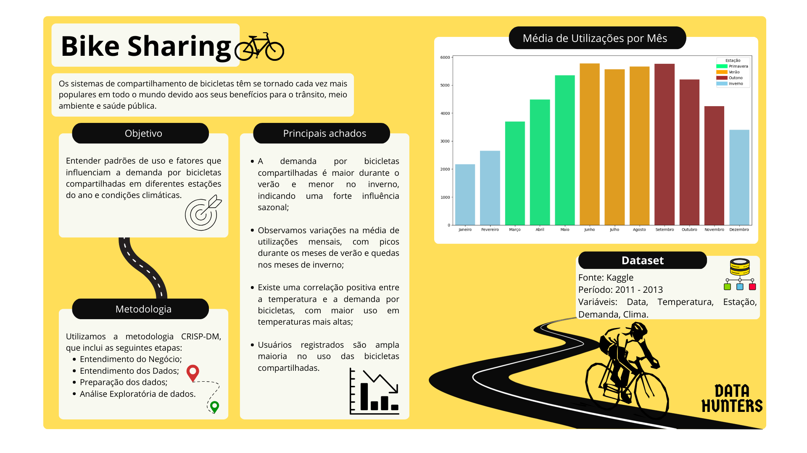

  
  
  
  

# Bike Sharing

Os sistemas de compartilhamento de bicicletas têm se tornado cada vez mais populares em todo o mundo devido aos seus benefícios para o trânsito, meio ambiente e saúde pública. A análise dos dados gerados por esses sistemas pode fornecer informações cruciais para otimizar seu funcionamento, identificar necessidades de manutenção e reposição de bicicletas, e entender melhor o comportamento dos usuários. Isso pode levar a um melhor planejamento urbano e políticas públicas mais eficientes.
.

## Resumo Gráfico

## Desenvolvedores
 - [Carla Neves](https://github.com/adiosCarla)
 - [Ernandes Costa](https://github.com/ernandes0)
 - [Fabrício Martins](https://github.com/FabricioMartinsss)
